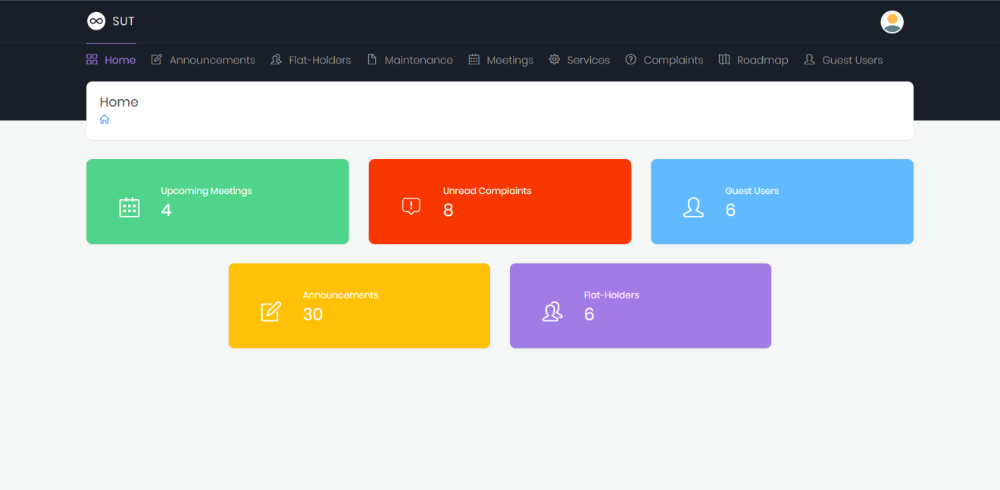
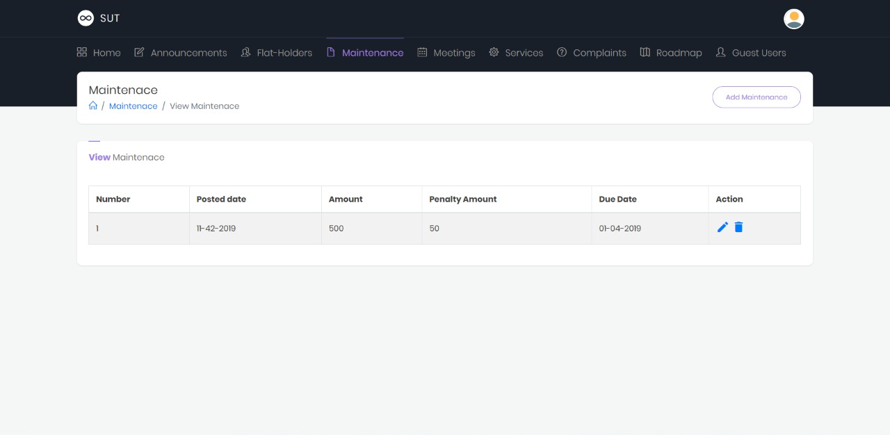
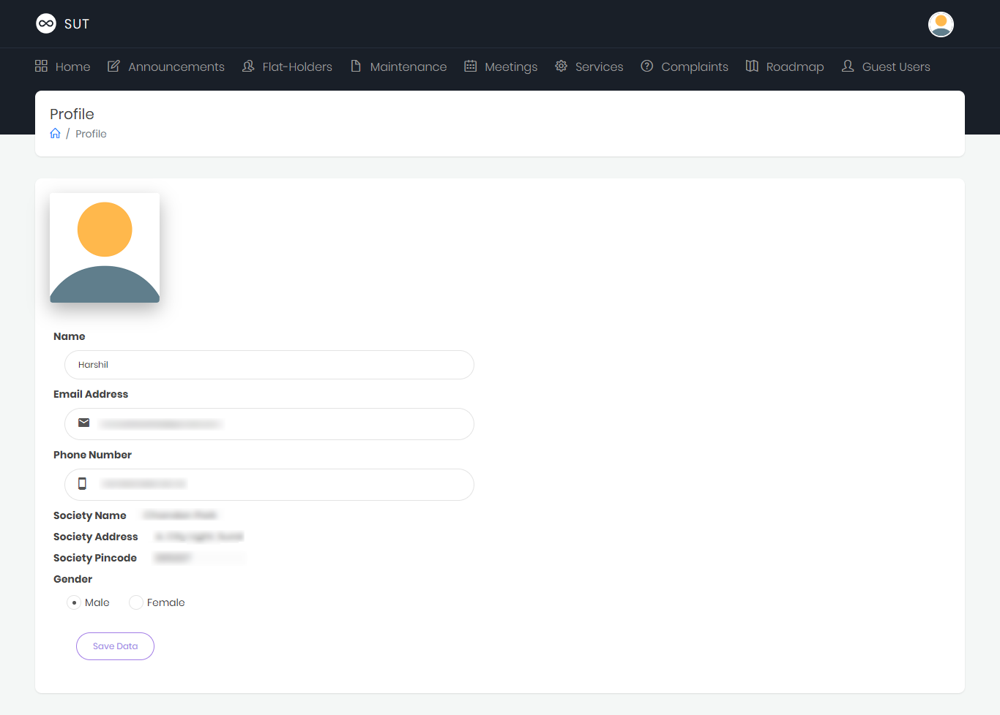

# Secretary Utility Tools

A system focused on problems faced by residents and their guests in society.

## Contents

- [Problem](#problem)
- [Proposed Solution](#proposed-solution)
- [Implementation](#implementation)
  - [Data Flow Diagram](#data-flow-diagram)
  - [Use Case Diagram](#use-case-diagram)
  - [Data Dictionary](#data-dictionary)
  - [Entity Realationship Diagram](#entity-realationship-diagram)
  - [Technologies Used](#technologies-used)
- [Screenshots](#screenshots)
- [Features](#features)
- [Limitations Of Implemented System](#limitations-of-implemented-system)
- [System Enhancement](#system-enhancement)

## Problem

The current system work through notice board. The resident has to goto to the place where the notice board is placed. There can be more than one notices at a time. It is possible that notices are put without any sort of order. It can be a exhausting work for some residents to go through all notices and find the most relevant from their busy schedule.

A possible solution is to use messaging application like WhatsApp, Telegram, etc. However, the problem with this solution is that the single group will contain information about the meetings, annoucements, maintenance, etc. So residents has to go through all messages. With this soltution it is not possible to get reminder for meetings, or maintenance due, except reminding by posting a message.

## Proposed Solution

To over come the problem described above, there can be a computerized system which is specifically designed for this purpose; where residents can notified for new annoucements, reminded for upcoming meetings and due maintenance.

## Implementation

### Data Flow Diagram

DFD Level 0

DFD Level 1

### Use Case Diagram

### Data Dictionary

#### Admins

*Admins* table is used to store information about Secretaries.

| **Field Name**       | **Data Type** | **Size** | **Constraint**              |
| -------------------- | ------------- | -------- | --------------------------- |
| AdminId              | Integer       |          | Primary Key, Auto Increment |
| AdminName            | Varchar       | 50       | Not Null                    |
| AdminEmailid         | Varchar       | 255      | Not Null                    |
| AdminPassword        | Varchar       | 32       | Not Null                    |
| AdminMobileNumber    | Varchar       | 13       | Not Null                    |
| AdminGender          | Varchar       | 6        | Not Null                    |
| AdminProfilePicture  | Varchar       | 100      |                             |
| AdminSocietyName     | Varchar       | 70       | Not Null                    |
| AdminSocietyAddress  | Varchar       | 255      | Not Null                    |
| AdminSociertyPincode | Varchar       | 6        | Not Null                    |

#### Users

*Users* table stores information of Flat-Holders.

| **Field Name**     | **Data Type** | **Size** | **Constraint**              |
| ------------------ | ------------- | -------- | --------------------------- |
| UserId             | Integer       |          | Primary Key, Auto Increment |
| UserName           | Varchar       | 40       | Not Null                    |
| UserEmailid        | Varchar       | 255      | Not Null                    |
| UserPassword       | Varchar       | 32       | Not Null                    |
| UserMobile         | Integer       |          | Not Null                    |
| UserGender         | Varchar       | 6        | Not Null                    |
| UserProfilePicture | Varchar       | 100      |                             |
| UserAdminId        | Integer       | 9        | Reference _Admins-AdminId_  |

#### GuestUser

*GuestUser* table used to store guest user’s information.

| **Field Name** | **Data Type** | **Size** | **Constraint**              |
| -------------- | ------------- | -------- | --------------------------- |
| GUId           | Integer       |          | Primary Key, Auto Increment |
| GUName         | Varchar       | 50       | Not Null                    |
| GUEmailId      | Varchar       | 255      | Not Null                    |
| GUPassword     | Varchar       | 32       | Not Null                    |
| GUAdminId      | Integer       |          | Reference _Admins-AdminID_  |

#### Meetings

All the meetings are stored in *Meetings* table. Used by Secretary and Flat-Holders. A meeting is added by Secretary.

| **Field Name** | **Data Type** | **Size** | **Constraint**              |
| -------------- | ------------- | -------- | --------------------------- |
| MeetingId      | Integer       | 9        | Primary Key, Auto Increment |
| MeetingTitle   | Varchar       | 70       |                             |
| MeetingMessage | Varchar       | 255      | Not Null                    |
| MeetingAddress | Varchar       | 255      |                             |
| MeetingDate    | Date          |          | Not Null                    |
| MeetingTime    | Time          | 6        | Not Null                    |
| MeetingAdminId | Integer       | 9        | Reference _Admins-AdminId_  |

#### ServiceProviders

*ServiceProviders* table stores information about services like carpenter, electrician etc.

| **Field Name**  | **Data Type** | **Size** | **Constraint**              |
| --------------- | ------------- | -------- | --------------------------- |
| SPId            | Integer       | 11       | Primary Key, Auto Increment |
| SPType          | Char          | 15       | Not Null                    |
| SPName          | Varchar       | 40       |                             |
| SPContactNumber | Integer       | 13       | Not Null                    |
| SPAdminId       | Integer       | 11       | Reference _Admins-AdminId_  |

#### Complaints

All the complaints are stored in *Complaints* table. Flat-Holder can complaint and Secretary see it.

| **Field Name**       | **Data Type** | **Size** | **Constraint**                     |
| -------------------- | ------------- | -------- | ---------------------------------- |
| ComplaintId          | Integer       | 11       | Primary Key, Auto Increment        |
| ComplaintTitle       | Varchar       | 70       | Not Null                           |
| ComplaintMessage     | Varchar       | 255      | Not Null                           |
| ComplaintImage       | Varchar       |          |                                    |
| ComplaintTime        | Time          |          | Not Null                           |
| ComplaintDate        | Date          |          | Not Null                           |
| ComplaintRead        | Char          | 1        | Default _n_; values(_y, n_)        |
| ComplaintUserId      | Integer       | 11       | Reference _Users-UserId_           |
| ComplaintApartmentId | Integer       | 11       | Reference _Apartments-ApartmentId_ |

#### Announcements

All the announcements that are published by secretary can be stored in *Announcements* table.

| **Field Name**          | **Data Type** | **Size** | **Constraint**                     |
| ----------------------- | ------------- | -------- | ---------------------------------- |
| AnnouncementId          | Integer       | 9        | Primary Key, Auto Increment        |
| AnnouncementTitle       | Varchar       | 50       |                                    |
| AnnouncementMessage     | Varchar       | 255      | Not Null                           |
| AnnouncementDate        | Date          |          | Not Null, _Current date_           |
| AnnouncementTime        | Time          |          | Not Null, _Current time_           |
| AnnouncementImage       | Varchar       |          | _Path_                             |
| AnnouncementImportant   | Char          | 1        | Default n, Values(_y, n_)          |
| AnnouncementAdminId     | Integer       | 9        | Reference _Admins-AdminId_         |
| AnnouncementApartmentId | Integer       | 11       | Reference _Apartments-ApartmentId_ |

#### Maintenances

Maintenance Records are stored in *Maintenances* table.

| **Field Name**         | **Data Type** | **Size** | **Constraint**              |
| ---------------------- | ------------- | -------- | --------------------------- |
| MaintenanceId          | Integer       | 11       | Primary Key, Auto Increment |
| MaintenanceDescription | Varchar       | 255      |                             |
| MaintenancePostedDate  | Varchar       | 20       | Not Null                    |
| MaintenanceMonth       | Varchar       | 9        | Not Null                    |
| MaintenanceYear        | Varchar       | 4        | Not Null                    |
| MaintenanceDueDate     | Varchar       | 20       | Not Null                    |
| MaintenanceAmount      | Integer       | 4,2      | Not Null                    |
| MaintenanceAdminId     | Integer       | 11       | Reference _Admin-AdminId_   |

#### RoadMaps

Details about the Roadmap of the society is stored in *Roadmaps* table.

| **Field Name** | **Data Type** | **Size** | **Constraint**              |
| -------------- | ------------- | -------- | --------------------------- |
| RoadMapId      | Integer       | 11       | Primary Key, Auto Increment |
| RoadMapImage   | Varchar       |          | Not Null                    |
| RoadMapAdminId | Integer       | 11       | Reference _Admins-AdminId_  |

### Entity Realationship Diagram

### Technologies Used

- Android Studio
- ASP.Net with C#
- HTML, CSS, JS, jQuery
- Boostrap theme [Infinio](https://themeforest.net/item/infinio-bootstrap-4-admin-dashboard-template/21824011)

## Screenshots

### Secretary's Portal

Registration

Login

Dashboard Home

Announcement Add

Announcement View

Flat-Holders Add

Flat-Holders View

Maintenance Add

Maintenance View

Meeting Add

Meeting View

Services

Complaints

Roadmap

Guest Users View

Profile View

Profile Edit

### Resident

Login

Forgot Password

Home Screen

Navigation Drawer

Announcements

Maintenance

Meetings

Complaints

Flat-Holders

Services

Service Provider

Settings

Profile

Profile Edit

Change Password

### Guest User

Registration

Login

Forgot Password

Home Screen

Flat-Holders

Secretary Details

Society Details

Settings

Profile

Profile Edit

Change Password

## Features

Features are divided into two categories: [Features used by Secretary and Residents](#features-used-by-secretary-and-residents) and [Features used by Secretary, Residents and Guest Users](#features-used-by-secretary-residents-and-guest-users).

Secretary interacts with all the features through webapp.

### Features used by Secretary and Residents

#### Annoucements

A feature which is designed for general annoucements (i.e. Holi Celebration, Update on last meeting's agenda, etc.).

#### Meeting

Meeting feature allows secretary to add new meetings, and the residents can get notified for upcoming meetings.

#### Maintenance

A feature which is used for adding and maintaing the records of maintenance.

#### Services

A feature which contains contact information about the services providers in the apartments. The services like Milkman, Electrician, Carpenter, etc. This feature is very useful for new residents.

#### Complaint

Residents can add problems they are facing in the apartment and report it to the Secretary.

### Features used by Secretary, Residents and Guest Users

#### Flatholders

This feature is to displays the name and apartment number of other residents in their society.

#### Roadmap

This features shows the map of the society. This feature is useful to new residents and guests of residents.

## Limitations Of Implemented System

- Requires active connection to the server, even for previously fetched data.
- Database is not a realtime database.
- Data are not encrypted.
- Residents are not notified for upcoming meetings.

## System Enhancement

- Overcoming the [above limitations](#limitations-of-implemented-system)
- Maintenance due notification
- Com

> **Note:** Flat-holders means Residents and Admins means Secretaries
